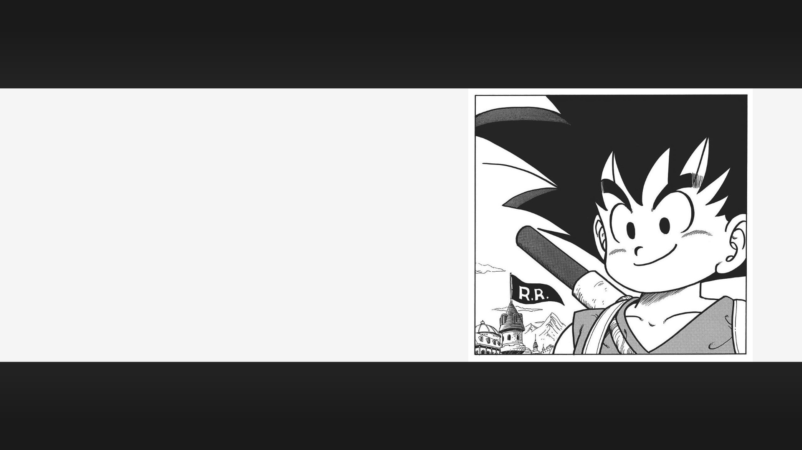
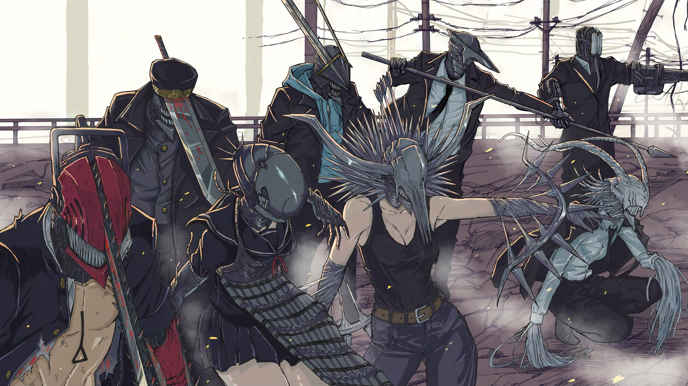
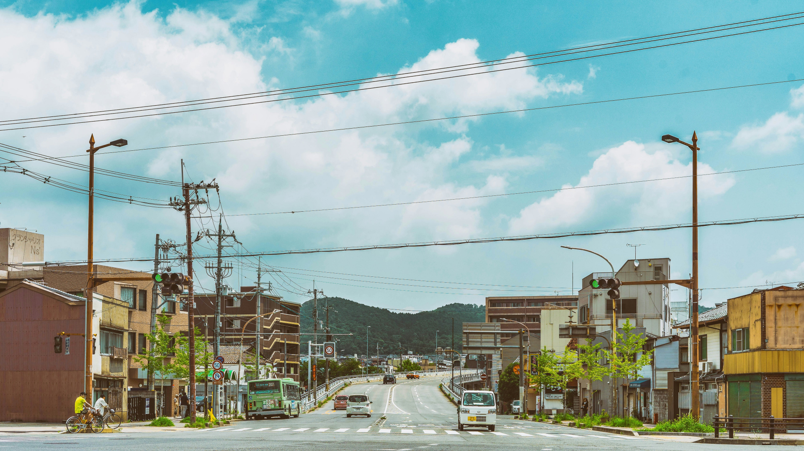
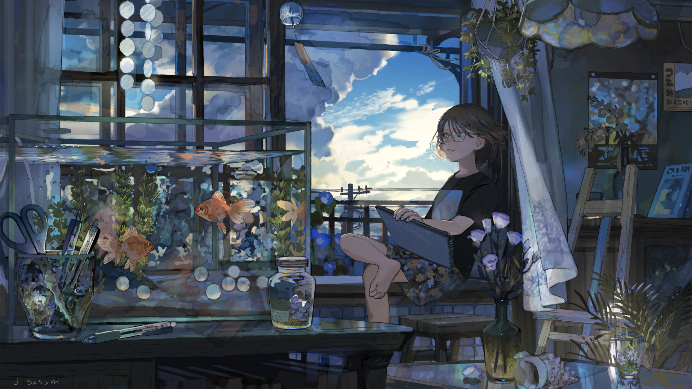

# walls

My wallpapers collections repo

## My collections 

    

        <h2 style="display: inline;">Anime Collections</h2> 
    

    

         
        
        
        
    

 

 

    

        <h2 style="display: inline;">Nature Collections</h2>
    

    

         
        
        
        
        
    

 

 

    

        <h2 style="display: inline;">Paintings Collections</h2>
    

    

         
        
        
        
        
        
        
        
    

 

 

    

        <h2 style="display: inline;">Random Collections</h2>
    

    

         
        
    

